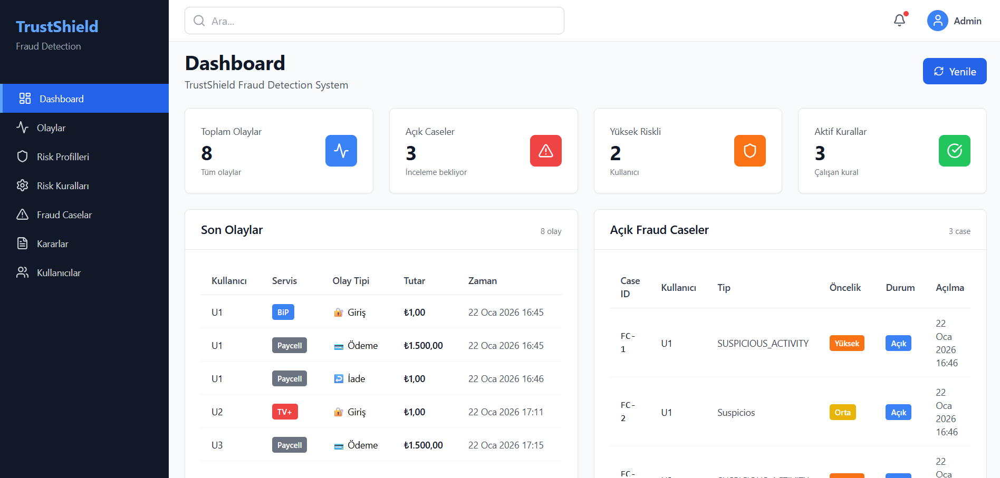
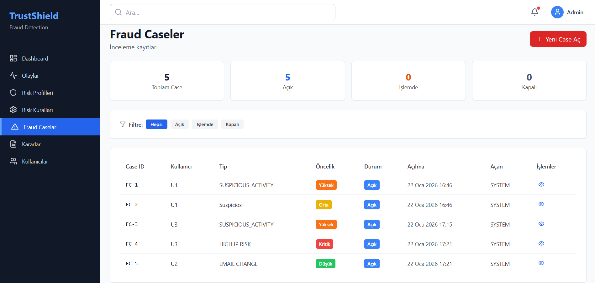
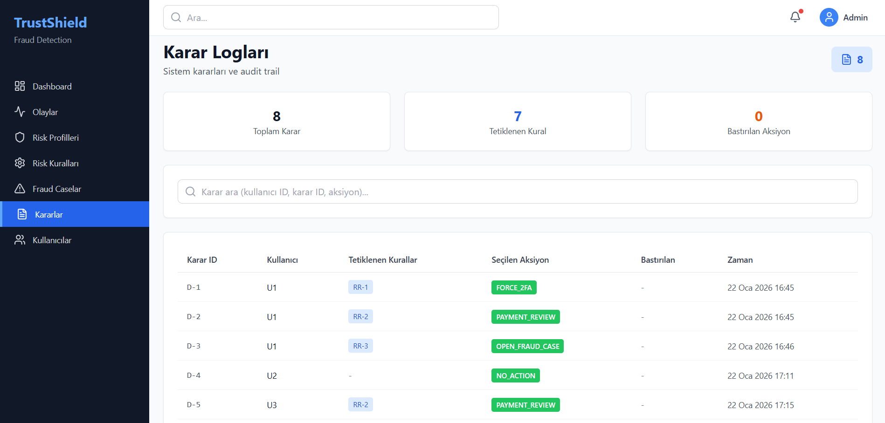

<p align="center">
  
  
  
</p>

<h1 align="center">🛡️ TrustShield</h1>

<p align="center">
  <strong>Modern Fraud Detection and Risk Management Platform for Turkcell Ecosystem</strong>
  <br />
  <i>Comprehensive Security for Paycell • BiP • Superonline • TV+</i>
</p>

<p align="center">
  
  
  
  
  
</p>

---

## 🎯 Project Overview

**TrustShield** is a high-performance security engine designed to detect and prevent fraudulent activities across Turkcell's digital services in real-time. By combining **Rule-Based Risk Assessment** with an intuitive **Case Management System**, it empowers security teams to mitigate risks before they escalate.

---

## 📸 Screenshots

### 🖥️ Main Dashboard

<p align="center">
  
</p>

### 🔍 Case Management & Audit Logs

<p align="center">
  
  
</p>

---

## ✨ Key Features

### 📊 Advanced Monitoring
- **Real-time Analytics** — Instant tracking of events, open cases, and high-risk user profiles
- **Dynamic Risk Scoring** — Visual risk indicators (0-100) with color-coded severity levels
- **Live Updates** — High-performance data fetching with manual and auto-refresh options

### 🛡️ Fraud & Risk Management
- **Smart Workflows** — Complete lifecycle management from `OPEN` → `IN_PROGRESS` → `CLOSED`
- **Custom Rule Engine** — Full CRUD support for creating complex risk rules with DSL syntax
- **Action Triggers** — Automated responses including `FORCE_2FA`, `TEMPORARY_BLOCK`, `PAYMENT_REVIEW`, and `OPEN_FRAUD_CASE`

### 🔔 Notification System
- **BiP Integration** — Real-time user notifications via BiP messaging platform
- **Audit Trail** — Complete decision logging for compliance and analysis

---

## 🏗️ Tech Stack

| Layer | Technology | Highlights |
|:------|:-----------|:-----------|
| **Backend** | Spring Boot 3.x, Java 17+ | RESTful API with JPA/Hibernate |
| **Frontend** | React 18, Vite 5.x | Fast SPA with Context API |
| **Styling** | Tailwind CSS 3.4 | Responsive UI with Turkcell theme |
| **Database** | MySQL 8.0 | Relational data with optimized queries |
| **Infrastructure** | Docker, Docker Compose | Containerized deployment |
| **Build** | Maven, npm | Automated dependency management |

---

## 🚀 Quick Start

### 🐳 Docker (Recommended)

The fastest way to run TrustShield:

```bash
# Clone the repository
git clone https://github.com/EmirrKilinc/trustshield.git
cd trustshield

# Start all services
docker-compose up --build
```

| Service | URL |
|:--------|:----|
| Frontend | http://localhost:5173 |
| Backend API | http://localhost:8080 |
| Swagger UI | http://localhost:8080/swagger-ui.html |

---

### 🛠️ Manual Setup

<details>
<summary><b>📦 Backend (Spring Boot)</b></summary>

```bash
cd backend

# Build the project
./mvnw clean install

# Run the application
./mvnw spring-boot:run
```

**Requirements:** Java 17+, Maven 3.8+

</details>

<details>
<summary><b>⚛️ Frontend (React + Vite)</b></summary>

```bash
cd frontend

# Install dependencies
npm install

# Start development server
npm run dev
```

**Requirements:** Node.js 18+, npm 9+

</details>

---

## 📂 Project Structure

```
trustshield/
├── 🐳 docker-compose.yml      # Multi-container orchestration
├── 📂 backend/                # Spring Boot Application
│   ├── src/main/java/
│   │   └── com/turkcell/demo/
│   │       ├── controller/    # REST Controllers
│   │       ├── service/       # Business Logic
│   │       ├── entity/        # JPA Entities
│   │       ├── repository/    # Data Access
│   │       ├── dto/           # Data Transfer Objects
│   │       └── dsl/           # Rule Engine (DSL Parser)
│   └── pom.xml
├── 📂 frontend/               # React Application
│   ├── src/
│   │   ├── components/        # Reusable UI Components
│   │   ├── pages/             # Page Components
│   │   ├── services/          # API Services
│   │   └── context/           # React Context
│   └── package.json
└── 📂 docs/
    └── screenshots/           # Application Screenshots
```

---

## 🔌 API Endpoints

| Method | Endpoint | Description |
|:-------|:---------|:------------|
| `POST` | `/api/v1/events` | Submit new event for processing |
| `GET` | `/api/v1/dashboard/summary` | Get dashboard overview |
| `GET` | `/api/v1/risk-rules` | List all risk rules |
| `POST` | `/api/v1/risk-rules` | Create new risk rule |
| `GET` | `/api/v1/fraud-cases` | List all fraud cases |
| `PATCH` | `/api/v1/fraud-cases/{id}/status` | Update case status |
| `GET` | `/api/v1/decisions` | List all decisions |
| `GET` | `/api/v1/risk-profiles` | List user risk profiles |

---

## 📊 Risk Rule DSL Syntax

TrustShield uses a custom DSL for defining risk rules:

```
service == 'BiP' && event_type == 'LOGIN' && meta contains 'device=new' && meta contains 'ip_risk=high'
```

**Supported Operators:**
- `==` — Equals
- `>=`, `>`, `<=`, `<` — Numeric comparisons
- `contains` — String/meta contains check
- `&&` — Logical AND

---

## 👥 Team

| Role | Contribution |
|:-----|:-------------|
| **Backend Developer** | Spring Boot API, Rule Engine, Database Design |
| **Frontend Developer** | React UI, Dashboard, Data Visualization |

---

## 📄 Event Details

- **Event:** Turkcell CodeNight 2026 Hackathon
- **Duration:** ~10 Hours
- **Scope:** End-to-end Fraud Management Solution
- **Challenge:** Build a real-time fraud detection system for Turkcell services

---

<p align="center">
  <br />
  <i>🛡️ Protect your future, not just your data.</i>
  <br /><br />
  <strong>© 2026 TrustShield — Turkcell CodeNight Project</strong>
</p>
